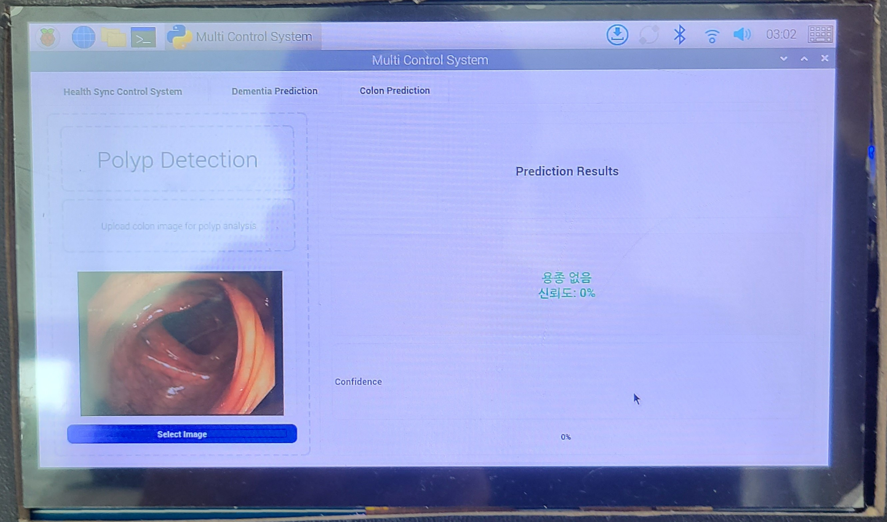

# 🏥 HealthSync: 스마트 헬스케어 IoT 시스템

HealthSync는 블루투스 기반 팬 제어 및 카메라 모니터링, 그리고 서버 연동 AI 예측 기능을 갖춘 **실시간 스마트 헬스케어 플랫폼**입니다.  
PyQt5 기반 GUI를 중심으로 아두이노 센서 데이터 수집, 환자별 예측 요청, 영상 스트리밍 모니터링을 통합 제공합니다.

---

## 🔧 주요 기능

### 🎛️ 1. PyQt5 기반 GUI 시스템
- 블루투스 장치 스캔 및 연결
- 팬 상태 실시간 제어 및 반영
- 환자 ID 입력 및 저장 기능
- AI 예측 결과 시각화 및 메시지 출력

### 🌬️ 2. 블루투스 팬 제어
- 연결된 장치에 `"FAN_ON"`, `"FAN_OFF"` 명령어 전송
- 버튼 클릭으로 즉시 전송 및 상태 표시

### 📷 3. 카메라 스트리밍 수신
- Bluetooth로 연결된 카메라 영상 실시간 수신
- OpenCV를 통해 프레임 디코딩 및 표시

### 📡 4. AI 예측 연동 (HTTP POST)
- 환자 ID, 예측 종류 (`colon`, `dementia`) 전송
- 서버에서 결과 수신 후 GUI에 출력

### 🌡️ 5. 환경 센서 데이터 수집 (Arduino 연동)
- 아두이노에서 온도, 습도, CO₂ 수치 시리얼 수신
- 추후 연계 분석 및 상태 판단 활용 가능

---

## 📸 실행 화면 예시

### 1. 환경 센서 데이터 수집 및 팬 제어 연동


> 실시간으로 온도, 습도, CO₂ 데이터를 수신하고 팬 제어 가능

---

### 2. 센서 값 변화 시각화


> 시간대별 환경 변화 데이터 표시

---

### 3. 대장 용종 예측 결과 화면



> 업로드된 장 이미지에 대해 서버 기반 AI 예측 결과를 시각적으로 제공

---

## 🧩 폴더 구조

```plaintext
healthsync/
├── main.py                      # 프로그램 실행 엔트리포인트
├── camera/                      # 영상 수신 및 디코딩
│   └── camera_receiver.py
├── gui/                         # PyQt5 GUI 컴포넌트
│   └── main_window.py
├── inference/                   # 서버 연동 AI 예측 요청
│   └── inference_request.py
├── arduino/                     # 아두이노 코드 및 설명
│   ├── Hwangyung_ii.ino
│   └── README.md
├── id_info.txt                  # 사용자 ID 저장 파일
├── requirements.txt             # 필요한 라이브러리 목록
├── docs/screenshots/            # 실행 화면 이미지 폴더
└── README.md                    # 프로젝트 설명 문서
```

---

## 🧠 기술 스택

- `Python 3.11`
- `PyQt5`, `OpenCV`, `requests`, `PyBluez`
- `Arduino IDE (C++)` + 환경 센서
- `HTTP 기반 Flask 서버 (외부 AI 추론 연동)`
- 플랫폼: Windows + Raspberry Pi 5 + Arduino Uno

---

## 👨‍💻 개발 기여

- **GUI/서버 연동 개발**: 공동 진행
- **하드웨어 연동 및 센서 수집 구현**: 직접 담당
- **Arduino 코드 설계 및 시리얼 통신 테스트** 수행
- 전체 시스템 통합 및 시나리오 설계 기여

---

## 💬 실행 방법

```bash
pip install -r requirements.txt
python main.py
```

> 아두이노는 별도로 USB 연결 후 시리얼 포트 지정 필요

---

## 📄 라이선스

본 프로젝트는 개인 포트폴리오 목적으로 작성되었으며, 상업적 사용을 금합니다.
